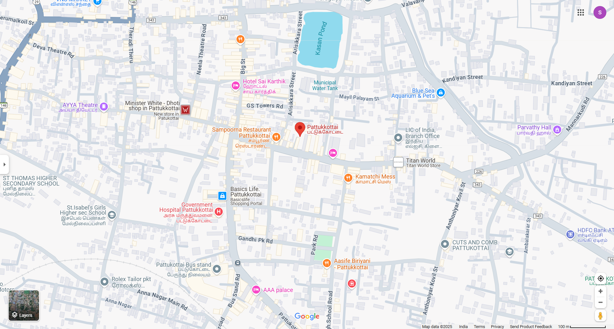

# Ex04 Places Around Me
## Date: 21.04.2025

## AIM
To develop a website to display details about the places around my house.

## DESIGN STEPS

### STEP 1
Create a Django admin interface.

### STEP 2
Download your city map from Google.

### STEP 3
Using ```<map>``` tag name the map.

### STEP 4
Create clickable regions in the image using ```<area>``` tag.

### STEP 5
Write HTML programs for all the regions identified.

### STEP 6
Execute the programs and publish them.

## CODE
```
map.html
<html>
    <head>
        <title>My City</title>
    </head>
    <body>
        <h1 align = "center">
            <font color="orange" size ="10"><b>PATTUKKOTTAI</b></font> 
        </h1>
        <h3 align="center">
            <font color="black" size ="5"><b>SHARON CLARA A (24900191)</b></font>
        </h3>
        <center>
            

<map name="image-map">
    <area target="" alt="ISABEL SCHOOL" title="ISABEL SCHOOL" href="school" coords="153,611,390,733" shape="rect">
    <area target="" alt="SAMPOORNA RESTAURANT" title="SAMPOORNA RESTAURANT" href="restaurant" coords="769,431,114" shape="circle">
    <area target="" alt="ARUN THEATRE" title="ARUN THEATRE" href="theatre" coords="255,333,103" shape="circle">
    <area target="" alt="HOSPITAL" title="HOSPITAL" href="hospital" coords="474,619,716,731" shape="rect">
    <area target="" alt="TITAN WORLD" title="TITAN WORLD" href="store" coords="1302,509,86" shape="circle">
</map>

            
        </center>
    </body>
</html>

school.html
<html>
    <head>
        <title>ISABEL SCHOOL</title>
    </head>
    <body bgcolor="lightpink">
        <h1 align="center">
            <font size="20"><b>ISABEL SCHOOL</b></font>
        </h1>
        <center></center>
        
        <p align ="center">
            <font size="5">ST.ISABEL'S GIRLS HIGHER SECONDARY SCHOOL PATTUKKOTTAI was established in 1981 and it is managed by the Pvt. Aided. It is located in Urban area. It is located in PATTUKKOTTAI block of THANJAVUR district of Tamil Nadu. The school consists of Grades from 6 to 12. The school is Girls and it doesn't have an attached pre-primary section. The school is N/A in nature and is not using school building as a shift-school. Tamil is the medium of instructions in this school. This school is approachable by all weather road. In this school academic session starts in April. Educational tours
                The school has Private building. It has got 18 classrooms for instructional purposes. All the classrooms are in good condition. It has 2 other rooms for non-teaching activities. The school has a separate room for Head master/Teacher. The school has Pucca boundary wall. The school has have electric connection. The source of Drinking Water in the school is None and it is functional. The school has 0 boys toilet and it is functional. and 41 girls toilet and it is functional. The school has a playground. The school has a library and has 5765 books in its library. The school does not need ramp for disabled children to access classrooms. The school has 22 computers for teaching and learning purposes and all are functional. The school is not having a computer aided learning lab. The school is Provided and Prepared in School Premises providing mid-day meal.</font>
            
            </p>
        </body>
        
    </html>

    hospital.html
    <html>
    <head>
        <title>GOVERNMENT HOSPITAL</title>
    </head>
    <body bgcolor="lightyellow">
        <h1 align="center">
            <font size="20"><b>GOVERNMENT HOSPITAL</b></font>
        </h1>
        <center></center>
        
        <p align ="center">
            <font size="6">Government Hospital is a dedicated hospital in Pattukottai Ho, Pattukottai, that offers high-quality healthcare services to patients of all ages. The hospital's team of professionals is highly skilled and well-versed in their respective domains. Patients can expect to receive top-notch treatments, surgeries, and procedures at the hospital. Additionally, Govern services to support patient health and well being. The hospital offers a variety of packages tailored to patients' needs and budget.</font>
            </p>
        </body>
        
    </html>
     
     restaurant.html
     <html>
    <head>
        <title>SAMPOORNA RESTAURANT</title>
    </head>
    <body bgcolor="lightblue">
        <h1 align="center">
            <font size="20"><b>SAMPOORNA RESTAURANT</b></font>
        </h1>
        <center></center>
        
        <p align ="center">
            <font size="6">Sampoorna Restaurant is a cherished culinary haven where tradition meets innovation. Known for its commitment to quality ingredients, delightful flavors, and exceptional service, Sampoorna Restaurant invites you to savor a dining experience like no other. The restaurant's interior is elegantly designed to provide a cozy yet refined ambiance, with warm lighting and tasteful decor that make every meal feel special. Whether you're here for a quick bite or a leisurely gathering, the inviting atmosphere at Sampoorna Restaurant ensures a memorable dining experience For those who appreciate quality food, a warm atmosphere, and attentive service, Sampoorna Restaurant in Pattukkottai.</font>
            </p>
        </body>
        
    </html>

    store.html
    <html>
    <head>
        <title>TITAN WORLD</title>
    </head>
    <body bgcolor="lightgray">
        <h1 align="center">
            <font size="20"><b>TITAN WORLD</b></font>
        </h1>
        <center></center>
        
        <p align ="center">
            <font size="5">World Of Titan Store in Pattukkottai, Pattukottai is a trusted supplier of ball bearings, offering a wide range of products that cater to various industrial and mechanical applications. With its high-quality bearings and exceptional customer service, World Of Titan Store has built a strong reputation. Be sure to check out their for your business's machinery requirements.At World Of Titan Store, quality is the top priority. Every ball bearing is manufactured using premium materials to ensure excellent performance and durability. The company's team is dedicated to maintaining the highest standards of quality, ensuring that customers in Pattukottai receive the best products for their mechanical needs.</font>
            </p>
        </body>
        
    </html>
    
    theatre.html
    <html>
    <head>
        <title>ARUN THEATRE</title>
    </head>
    <body bgcolor="white">
        <h1 align="center">
            <font size="20"><b>ARUN THEATRE</b></font>
        </h1>
        <center></center>
        
        <p align ="center">
            <font size="5">Arun Theatre in Pattukkottai is a movie theater located at 104 Pannavayal Road, Aranthangi Mukkam, Pattukkottai. It's currently temporarily closed for improvements. While specific historical details are limited, the theater's general history is tied to its location in Pattukkottai and its role as a venue for entertainment in the area. </font>
            </p>
        </body>
        
    </html>

```

## OUTPUT

   


## RESULT
The program for implementing image maps using HTML is executed successfully.
